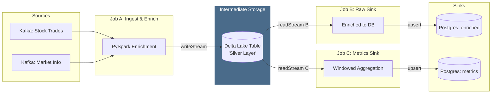
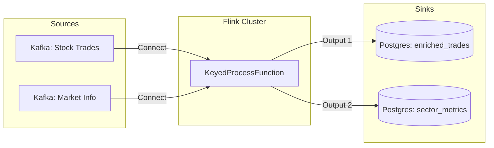
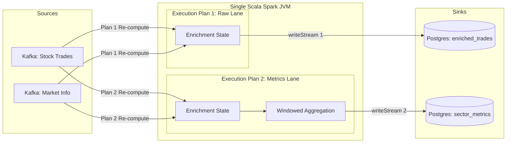

# streams-stateful-enrichment-aggregation-methods

# 🚀 Financial Streaming Pipeline: Multi-Architecture Benchmarking

This repository explores the evolution of real-time data engineering patterns, specifically focusing on the challenges of **Enrichment** and **Stateful Aggregation**. We benchmark three distinct ways to handle high-velocity stock market data using PySpark, Apache Flink, and Scala Spark.

## 🛠 The Challenge
Ingest two high-frequency Kafka streams:
1. **Stock Trades**: Raw execution data (Symbol, Price, Volume, Timestamp).
2. **Market Info**: Metadata (Symbol, Company Name, Sector, Market Cap).

**The Goal:** Produce an enriched stream and a windowed metrics table (1-minute tumbling windows) with strict **idempotency** and **fault tolerance**.

---

## 🏗 Architectural Evolution

### 1. PySpark + Delta Lake (The Staged Pattern)
Initially, we attempted a direct PySpark stream with two sinks. However, we found that the **Py4J gateway overhead** and the management of two stateful streams (enrichment + aggregation) caused the job to lag significantly behind its `TriggerTime`.

**The Solution:**
* **Job A:** PySpark reads from Kafka and persists raw enriched data into a **Delta Lake** table.
* **Job B:** A separate consumer reads from Delta and aggregates metrics into Postgres.

* **Pros:** Highly resilient; Delta Lake provides a reliable buffer and "Time Travel" capabilities.
* **Cons:** Highest resource footprint (two jobs + storage I/O). The "two-hop" approach adds significant end-to-end latency.

### 2. Apache Flink (The Unified Pattern)
A transition to a "True Streaming" engine using Flink's `connect` and `KeyedProcessFunction`.

* **Pros:** Lowest possible latency (event-at-a-time). Native "fan-out" to multiple sinks is seamless.
* **Cons:** High architectural complexity. Requires a dedicated JobManager/TaskManager infrastructure that can be heavy for small-scale deployments.

### 3. Scala Spark (The Optimized JVM Pattern) - *Current Implementation*
We moved the logic to Scala to eliminate Python serialization bottlenecks and used a "Hard Way" approach: two independent `writeStream` sinks within a single JVM application.

* **Pros:** Performance is nearly on par with Flink for micro-batching. Directly leverages JVM memory for state, reducing overhead.
* **Cons:** Requires manual management of two checkpoints and careful tuning of stateful union logic.

---

## 📊 Architecture Diagram

### 1. Pyspark

### 2. Flink (Unified Pattern)

### 3. Scala Spark 

